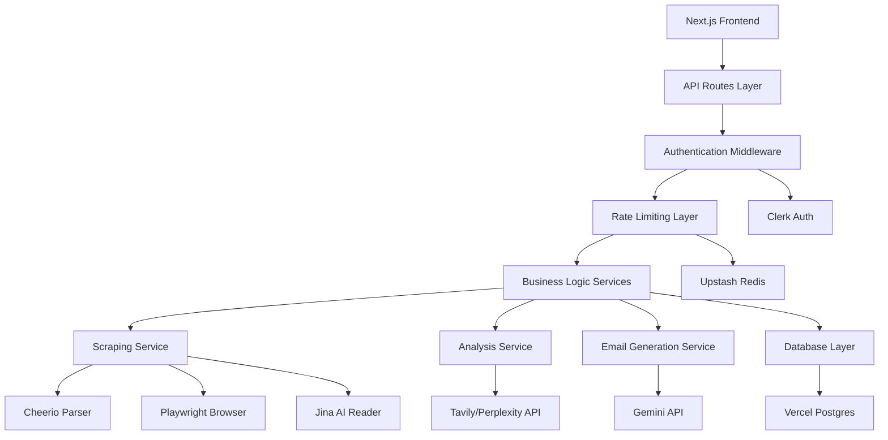

# Design Document: Agentic Outreach Researcher

## Overview

The Agentic Outreach Researcher is a full-stack Next.js application that leverages AI and web scraping to generate personalized outreach emails. The system follows a pipeline architecture where data flows through distinct stages: scraping → analysis → generation. The application uses a modern tech stack with Next.js 14 App Router, TypeScript, Prisma ORM with Vercel Postgres, and Clerk for authentication.

The core workflow involves:
1. User submits a company URL
2. System scrapes company information using multiple strategies
3. System analyzes scraped data and searches for recent news
4. AI generates a personalized email using Gemini API
5. System saves research to database and displays results

## Architecture

### High-Level Architecture



### System Layers

**Presentation Layer (Frontend)**
- Next.js 14 App Router pages and components
- shadcn/ui and Sera UI components
- Framer Motion animations
- Client-side state management with React hooks
- Real-time progress indicators

**API Layer**
- Next.js API Routes for RESTful endpoints
- Authentication middleware using Clerk
- Rate limiting middleware using Upstash Redis
- Request validation and error handling

**Service Layer**
- ScrapingService: Orchestrates web scraping strategies
- AnalysisService: Processes data and searches news
- EmailGenerationService: Interfaces with Gemini API
- ResearchService: Manages research CRUD operations
- UserService: Handles user statistics and subscription

**Data Layer**
- Prisma ORM for type-safe database access
- Vercel Postgres for data persistence
- Database transactions for data integrity

**External Services**
- Clerk: Authentication and user management
- Gemini API: AI-powered email generation
- Tavily/Perplexity API: News and web search
- Jina AI Reader: Fallback web scraping
- Upstash Redis: Rate limiting and caching

## Components and Interfaces

### Frontend Components

**Page Components**
- `app/page.tsx`: Landing page with animations
- `app/dashboard/page.tsx`: Main dashboard with stats
- `app/research/page.tsx`: Research interface with URL input
- `app/history/page.tsx`: Research history with search and filters
- `app/settings/page.tsx`: User settings and preferences

**UI Components**
- `ResearchForm`: URL input and submission
- `ResearchResults`: Display generated email and insights
- `ProgressIndicator`: Real-time progress during generation
- `ResearchCard`: Individual research entry display
- `StatsWidget`: Dashboard statistics display
- `HistoryTable`: Searchable and filterable research list
- `EmailEditor`: Edit and copy email content
- `TagManager`: Add and remove tags from research

### API Routes

**Research Endpoints**
```typescript
// GET /api/researches - List all researches for authenticated user
interface GetResearchesResponse {
  researches: Research[];
  total: number;
  page: number;
  limit: number;
}

// POST /api/researches - Create new research
interface CreateResearchRequest {
  companyUrl: string;
}

interface CreateResearchResponse {
  research: Research;
  status: 'success' | 'error';
  message?: string;
}

// GET /api/researches/[id] - Get single research
interface GetResearchResponse {
  research: Research;
}

// PATCH /api/researches/[id] - Update research
interface UpdateResearchRequest {
  emailSubject?: string;
  emailBody?: string;
  isFavorite?: boolean;
  tags?: string[];
}

// DELETE /api/researches/[id] - Delete research
interface DeleteResearchResponse {
  success: boolean;
}
```

**Processing Endpoints**
```typescript
// POST /api/scrape - Scrape company information
interface ScrapeRequest {
  url: string;
}

interface ScrapeResponse {
  companyName: string;
  description: string;
  industry?: string;
  size?: string;
  location?: string;
  rawData: Record<string, any>;
}

// POST /api/analyze - Analyze scraped data
interface AnalyzeRequest {
  companyName: string;
  scrapedData: Record<string, any>;
}

interface AnalyzeResponse {
  newsArticles: NewsArticle[];
  linkedinData?: LinkedInData;
  insights: string[];
}

// POST /api/generate - Generate personalized email
interface GenerateRequest {
  companyName: string;
  scrapedData: Record<string, any>;
  newsArticles: NewsArticle[];
  insights: string[];
}

interface GenerateResponse {
  subject: string;
  body: string;
}
```

**User Endpoints**
```typescript
// GET /api/users/stats - Get user statistics
interface UserStatsResponse {
  totalResearches: number;
  monthlyUsage: number;
  monthlyLimit: number;
  favoritesCount: number;
  recentResearches: Research[];
}
```

### Service Interfaces

**ScrapingService**
```typescript
interface IScrapingService {
  scrapeUrl(url: string): Promise<ScrapedData>;
  scrapeWithCheerio(url: string): Promise<ScrapedData>;
  scrapeWithPlaywright(url: string): Promise<ScrapedData>;
  scrapeWithJina(url: string): Promise<ScrapedData>;
  extractCompanyInfo(html: string): CompanyInfo;
}

interface ScrapedData {
  companyName: string;
  description: string;
  industry?: string;
  size?: string;
  location?: string;
  rawHtml: string;
  metadata: Record<string, any>;
}
```

**AnalysisService**
```typescript
interface IAnalysisService {
  searchNews(companyName: string, daysBack: number): Promise<NewsArticle[]>;
  searchLinkedIn(companyName: string): Promise<LinkedInData | null>;
  extractInsights(scrapedData: ScrapedData, news: NewsArticle[]): string[];
}

interface NewsArticle {
  title: string;
  url: string;
  publishedDate: Date;
  summary: string;
  source: string;
}

interface LinkedInData {
  companyUrl: string;
  followers?: number;
  recentPosts?: string[];
  employees?: number;
}
```

**EmailGenerationService**
```typescript
interface IEmailGenerationService {
  generateEmail(context: EmailContext): Promise<GeneratedEmail>;
  buildPrompt(context: EmailContext): string;
}

interface EmailContext {
  companyName: string;
  description: string;
  newsArticles: NewsArticle[];
  insights: string[];
  scrapedData: Record<string, any>;
}

interface GeneratedEmail {
  subject: string;
  body: string;
}
```

**RateLimitService**
```typescript
interface IRateLimitService {
  checkLimit(userId: string): Promise<RateLimitResult>;
  incrementUsage(userId: string): Promise<void>;
  resetMonthlyUsage(userId: string): Promise<void>;
}

interface RateLimitResult {
  allowed: boolean;
  remaining: number;
  limit: number;
  resetDate: Date;
}
```

## Data Models

### Prisma Schema

```prisma
model User {
  id            String         @id @default(cuid())
  email         String         @unique
  name          String?
  clerkId       String         @unique
  imageUrl      String?
  createdAt     DateTime       @default(now())
  updatedAt     DateTime       @updatedAt
  researches    Research[]
  subscription  Subscription?
}

model Research {
  id              String    @id @default(cuid())
  userId          String
  user            User      @relation(fields: [userId], references: [id], onDelete: Cascade)
  companyUrl      String
  companyName     String
  scrapedData     Json
  newsArticles    Json
  linkedinData    Json?
  emailSubject    String
  emailBody       String    @db.Text
  insights        Json
  status          String    @default("completed")
  generatedAt     DateTime  @default(now())
  isFavorite      Boolean   @default(false)
  tags            String[]
  
  @@index([userId])
  @@index([generatedAt])
  @@index([isFavorite])
}

model Subscription {
  id              String    @id @default(cuid())
  userId          String    @unique
  user            User      @relation(fields: [userId], references: [id], onDelete: Cascade)
  plan            String    @default("free")
  monthlyUsage    Int       @default(0)
  monthlyLimit    Int       @default(5)
  resetDate       DateTime
  stripeCustomerId String?
  stripeSubscriptionId String?
  createdAt       DateTime  @default(now())
  updatedAt       DateTime  @updatedAt
}
```

### Data Flow

**Research Creation Flow**
1. User submits Company_URL via ResearchForm
2. Frontend calls POST /api/researches with URL
3. API validates authentication and rate limits
4. API calls ScrapingService.scrapeUrl()
5. ScrapingService tries strategies in order: Cheerio → Playwright → Jina
6. API calls AnalysisService.searchNews() and searchLinkedIn()
7. API calls EmailGenerationService.generateEmail()
8. API creates Research record in database
9. API increments user's monthly usage
10. API returns complete Research object to frontend

**Research Retrieval Flow**
1. User navigates to History page
2. Frontend calls GET /api/researches with pagination and filters
3. API validates authentication
4. API queries database with filters (tags, favorites, search term)
5. API returns paginated results
6. Frontend renders ResearchCard components

## Correctness Properties

*A property is a characteristic or behavior that should hold true across all valid executions of a system—essentially, a formal statement about what the system should do. Properties serve as the bridge between human-readable specifications and machine-verifiable correctness guarantees.*


### Property 1: Authentication Creates or Retrieves User

*For any* valid authentication credentials, successful authentication should result in a user record existing in the database with the correct clerkId.

**Validates: Requirements 1.2**

### Property 2: Authentication Redirects to Dashboard

*For any* successful authentication, the system should redirect the user to the dashboard page.

**Validates: Requirements 1.3**

### Property 3: Sign Out Clears Session

*For any* authenticated user, signing out should clear the session and redirect to the landing page.

**Validates: Requirements 1.4**

### Property 4: Protected Routes Require Authentication

*For any* protected route, an unauthenticated request should be redirected to the sign-in page.

**Validates: Requirements 1.5**

### Property 5: Valid URLs Initiate Research

*For any* valid company URL, submitting it should initiate the research process and return a completed research object.

**Validates: Requirements 2.1**

### Property 6: Research Pipeline Completeness

*For any* research process, the system should execute all pipeline stages (scraping → news analysis → LinkedIn lookup → email generation) and produce a research object with all required fields populated.

**Validates: Requirements 2.2, 2.3, 2.4, 2.5**

### Property 7: Research Persistence

*For any* completed research, the system should persist all data fields to the database and the research should be retrievable by its ID.

**Validates: Requirements 2.7, 6.1**

### Property 8: Invalid URL Error Handling

*For any* invalid or inaccessible URL, the system should return an error message without creating a research record.

**Validates: Requirements 2.8**

### Property 9: Scraper Extracts Required Fields

*For any* valid company URL, the scraper should extract at minimum the company name and description fields.

**Validates: Requirements 3.1**

### Property 10: Scraping Failure Returns Error

*For any* URL where all scraping methods fail, the system should return a descriptive error message.

**Validates: Requirements 3.5**

### Property 11: News Search Time Window

*For any* company analysis, the news search should only return articles published within the last 90 days.

**Validates: Requirements 4.1**

### Property 12: LinkedIn Data Retrieval

*For any* company with available LinkedIn data, the analysis should include LinkedIn information in the results.

**Validates: Requirements 4.3**

### Property 13: Analysis Produces Structured Output

*For any* completed analysis, the output should be a structured object with newsArticles array and insights array.

**Validates: Requirements 4.4**

### Property 14: Email Generation Completeness

*For any* email generation request, the generated email should contain both a non-empty subject line and a non-empty body.

**Validates: Requirements 5.2, 5.5**

### Property 15: History Retrieval Completeness and Ordering

*For any* user, retrieving their history should return all their research entries ordered by generation date (most recent first).

**Validates: Requirements 6.2, 9.3**

### Property 16: History Search Filtering

*For any* search term, the filtered history results should only include research entries where the company name, URL, or tags contain the search term.

**Validates: Requirements 6.3**

### Property 17: Research Retrieval Completeness

*For any* research ID, retrieving the research should return an object with all fields populated (scrapedData, newsArticles, insights, emailSubject, emailBody).

**Validates: Requirements 6.4**

### Property 18: Research Deletion

*For any* research entry, deleting it should remove it from the database and subsequent retrieval attempts should fail.

**Validates: Requirements 6.5**

### Property 19: Favorite Toggle Persistence

*For any* research entry, toggling the favorite status should update the isFavorite flag in the database and the change should be reflected in subsequent retrievals.

**Validates: Requirements 7.1**

### Property 20: Tag Management Round Trip

*For any* research entry and any set of tags, adding tags then retrieving the research should return the research with those tags, and removing tags then retrieving should return the research without those tags.

**Validates: Requirements 7.2, 7.5**

### Property 21: Favorite Filtering

*For any* user with favorited research entries, filtering by favorites should return only entries where isFavorite is true.

**Validates: Requirements 7.3**

### Property 22: Tag Filtering

*For any* tag, filtering by that tag should return all research entries whose tags array contains that tag.

**Validates: Requirements 7.4**

### Property 23: Rate Limit Enforcement

*For any* user, attempting to create research when monthly usage equals monthly limit should be rejected with an error message.

**Validates: Requirements 8.1, 8.4**

### Property 24: Usage Counter Increment

*For any* successfully completed research, the user's monthly usage counter should increase by exactly 1.

**Validates: Requirements 8.6**

### Property 25: Monthly Usage Reset

*For any* user whose reset date has passed, the monthly usage counter should be reset to 0.

**Validates: Requirements 8.5**

### Property 26: Dashboard Statistics Accuracy

*For any* user, the dashboard statistics (total research count, monthly usage, favorites count, usage percentage) should match the actual counts from the database.

**Validates: Requirements 9.1, 9.2, 9.4, 9.5**

### Property 27: Clipboard Copy Functionality

*For any* email content, clicking copy should place the exact email text into the clipboard.

**Validates: Requirements 10.2**

### Property 28: Edit Persistence

*For any* research entry, editing the email subject or body and saving should persist the changes to the database and subsequent retrievals should return the edited content.

**Validates: Requirements 10.4**

### Property 29: Export Formatting

*For any* research entry, exporting should produce a valid formatted output containing all research data.

**Validates: Requirements 10.5**

### Property 30: Progress Indicator Updates

*For any* research process, the progress indicator should update at each stage transition (scraping → analyzing → generating → complete).

**Validates: Requirements 11.5**

### Property 31: Theme Persistence

*For any* theme preference change (light/dark), the preference should be persisted and restored on subsequent page loads.

**Validates: Requirements 12.5**

### Property 32: Dark Mode Application

*For any* component, enabling dark mode should apply dark theme colors to that component.

**Validates: Requirements 12.4**

### Property 33: API Error Messaging

*For any* failed API request, the system should display a user-friendly error message to the user.

**Validates: Requirements 13.1**

### Property 34: Scraping Error Messaging

*For any* scraping failure, the system should provide a specific error message explaining the failure.

**Validates: Requirements 13.3**

### Property 35: Success Confirmation

*For any* successful operation (create, update, delete), the system should display a confirmation message.

**Validates: Requirements 13.5**

### Property 36: Atomic Research Creation

*For any* research creation, either all fields should be persisted to the database or none should be (atomic operation).

**Validates: Requirements 14.1**

### Property 37: Transaction Rollback

*For any* database operation that fails, no partial data should remain in the database.

**Validates: Requirements 14.2**

### Property 38: Subscription Update Integrity

*For any* subscription change, the subscription record should be updated and the user's usage history should remain intact.

**Validates: Requirements 14.3**

### Property 39: Cascade Deletion

*For any* user deletion, all related research entries and subscription records should also be deleted.

**Validates: Requirements 14.5**

## Error Handling

### Error Categories

**Validation Errors**
- Invalid URL format
- Missing required fields
- Invalid data types
- Out-of-range values

**External Service Errors**
- Scraping failures (timeout, blocked, 404)
- API rate limits (Gemini, Tavily, Jina)
- Network connectivity issues
- Authentication failures

**Database Errors**
- Connection failures
- Transaction conflicts
- Constraint violations
- Query timeouts

**Business Logic Errors**
- Rate limit exceeded
- Insufficient permissions
- Resource not found
- Duplicate operations

### Error Handling Strategy

**API Route Error Handling**
```typescript
try {
  // Operation
  return NextResponse.json({ success: true, data });
} catch (error) {
  if (error instanceof ValidationError) {
    return NextResponse.json(
      { success: false, error: error.message },
      { status: 400 }
    );
  }
  
  if (error instanceof RateLimitError) {
    return NextResponse.json(
      { success: false, error: 'Rate limit exceeded', upgradeUrl: '/pricing' },
      { status: 429 }
    );
  }
  
  if (error instanceof NotFoundError) {
    return NextResponse.json(
      { success: false, error: 'Resource not found' },
      { status: 404 }
    );
  }
  
  // Log unexpected errors
  console.error('Unexpected error:', error);
  
  return NextResponse.json(
    { success: false, error: 'An unexpected error occurred' },
    { status: 500 }
  );
}
```

**Service Layer Error Handling**
- Wrap external API calls in try-catch blocks
- Implement retry logic with exponential backoff for transient failures
- Use circuit breaker pattern for external services
- Log all errors with context for debugging
- Return typed error objects with actionable messages

**Frontend Error Handling**
- Display toast notifications for errors
- Show inline validation errors on forms
- Provide retry buttons for transient failures
- Offer alternative actions when operations fail
- Log errors to monitoring service (e.g., Sentry)

**Database Error Handling**
- Use transactions for multi-step operations
- Implement automatic retry for deadlocks
- Handle unique constraint violations gracefully
- Provide meaningful error messages for constraint violations
- Log query performance issues

### Fallback Strategies

**Scraping Fallbacks**
1. Try Cheerio (fast, lightweight)
2. If fails, try Playwright (handles JavaScript)
3. If fails, try Jina AI Reader (external service)
4. If all fail, return error with suggestion to try different URL

**API Fallbacks**
- Cache successful responses for 24 hours
- Use cached data if API is unavailable
- Degrade gracefully (e.g., skip LinkedIn if unavailable)
- Queue failed requests for retry

## Testing Strategy

### Dual Testing Approach

The application will use both unit tests and property-based tests to ensure comprehensive coverage:

**Unit Tests** focus on:
- Specific examples and edge cases
- Integration points between components
- Error conditions and validation
- UI component rendering
- API endpoint responses

**Property-Based Tests** focus on:
- Universal properties that hold for all inputs
- Data integrity across operations
- Business logic correctness
- State transitions and workflows

### Property-Based Testing Configuration

**Library Selection**: Use `fast-check` for TypeScript/JavaScript property-based testing

**Test Configuration**:
- Minimum 100 iterations per property test
- Each test tagged with feature name and property number
- Tag format: `// Feature: agentic-outreach-researcher, Property N: [property text]`

**Example Property Test**:
```typescript
import fc from 'fast-check';

// Feature: agentic-outreach-researcher, Property 7: Research Persistence
test('completed research is persisted and retrievable', async () => {
  await fc.assert(
    fc.asyncProperty(
      fc.webUrl(), // Generate random valid URLs
      async (companyUrl) => {
        const research = await createResearch(userId, companyUrl);
        const retrieved = await getResearch(research.id);
        
        expect(retrieved).toBeDefined();
        expect(retrieved.companyUrl).toBe(companyUrl);
        expect(retrieved.emailSubject).toBeTruthy();
        expect(retrieved.emailBody).toBeTruthy();
      }
    ),
    { numRuns: 100 }
  );
});
```

### Test Coverage Goals

**Unit Test Coverage**:
- API routes: 90%+ coverage
- Service layer: 85%+ coverage
- Utility functions: 95%+ coverage
- React components: 70%+ coverage

**Property Test Coverage**:
- All 39 correctness properties implemented as property tests
- Each property maps to specific requirements
- Properties cover critical business logic and data integrity

### Testing Tools

- **Test Runner**: Jest
- **Property Testing**: fast-check
- **React Testing**: React Testing Library
- **API Testing**: Supertest
- **Database Testing**: In-memory Postgres or test database
- **Mocking**: Jest mocks for external services
- **E2E Testing**: Playwright (optional, for critical user flows)

### Test Organization

```
tests/
├── unit/
│   ├── api/
│   │   ├── researches.test.ts
│   │   ├── users.test.ts
│   │   └── scrape.test.ts
│   ├── services/
│   │   ├── scraping.test.ts
│   │   ├── analysis.test.ts
│   │   ├── email-generation.test.ts
│   │   └── rate-limit.test.ts
│   └── components/
│       ├── ResearchForm.test.tsx
│       ├── ResearchResults.test.tsx
│       └── HistoryTable.test.tsx
├── properties/
│   ├── authentication.properties.test.ts
│   ├── research-pipeline.properties.test.ts
│   ├── data-persistence.properties.test.ts
│   ├── rate-limiting.properties.test.ts
│   └── statistics.properties.test.ts
└── integration/
    ├── research-flow.test.ts
    └── user-workflow.test.ts
```

### Mocking Strategy

**External Services**:
- Mock Clerk authentication in tests
- Mock Gemini API responses with realistic data
- Mock Tavily/Perplexity API responses
- Mock Jina AI Reader responses
- Use MSW (Mock Service Worker) for HTTP mocking

**Database**:
- Use in-memory Postgres for fast tests
- Seed test data before each test suite
- Clean up after each test
- Use transactions for test isolation

**Redis**:
- Use in-memory Redis or mock Redis client
- Test rate limiting logic without external dependencies
